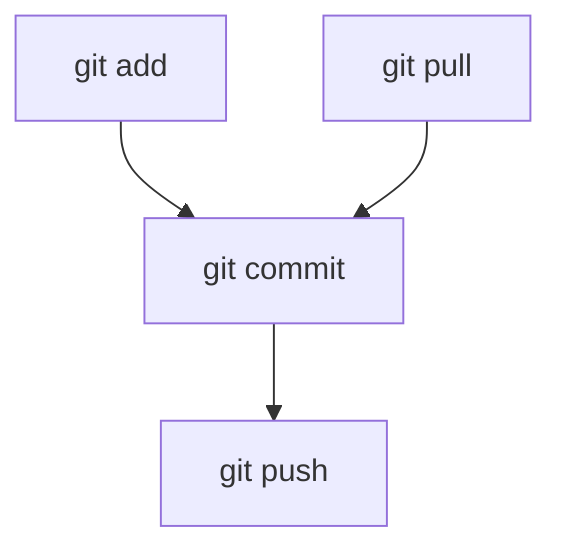

# 🌱 pruebaCh59  
✨ *Prueba y práctica de Git / GitHub* ✨  

  
  


---

## 📚 Introducción
Este repositorio es un espacio para **aprender, practicar y romper sin miedo** 🧑‍💻.  
Aquí encontrarás los **comandos básicos de Git** organizados por secciones, con ejemplos claros.  

---

## 🔑 Configuración inicial
```bash
# Configurar nombre de usuario
git config --global user.name "TuNombre"

# Configurar correo electrónico
git config --global user.email "tuemail@example.com"
```

---

## 📝 Guardar cambios
```bash
# Ver estado de archivos
git status

# Agregar archivo específico
git add archivo.txt

# Agregar todos los archivos modificados
git add .

# Confirmar cambios con un mensaje
git commit -m "Mensaje de commit"
```

---

## 🌍 Subir cambios a GitHub
```bash
# Enviar commits a la rama principal (ejemplo: main)
git push origin main
```

---

## ⬇️ Descargar cambios desde GitHub
```bash
# Traer los cambios de la rama remota
git pull origin main
```

---

## 🔄 Traer cambios sin fusionar (fetch)
```bash
# Descarga cambios sin fusionar automáticamente
git fetch origin
```

---

## 🌳 Ramas
```bash
# Crear nueva rama
git branch mi-rama

# Cambiar de rama
git checkout mi-rama

# Crear y cambiar de rama en un solo paso
git checkout -b nueva-rama
```

---

## 🔀 Merge
```bash
# Estando en la rama principal, fusionar cambios desde otra rama
git merge mi-rama
```

---

## 🌀 Flujo básico de trabajo (visual)


---

## 🎨 Texto estilizado con Unicode
𝔼𝓼𝓽𝓮 𝓻𝓮𝓹𝓸 𝓮𝓼 𝓹𝓪𝓻𝓪 𝓹𝓻𝓪𝓬𝓽𝓲𝓬𝓪𝓻  
𝐺𝑖𝑡 𝑦 𝐺𝑖𝑡𝐻𝑢𝑏 💻  

---

## 🛠 Próximos pasos
- [ ] Probar todos los comandos  
- [ ] Crear ramas y hacer merge  
- [ ] Hacer un fork y practicar PR (pull requests)  
- [ ] Romper y arreglar 😎  

---

💡 *Recuerda: Git es como un diario de tus proyectos, cada commit cuenta tu historia.*  
